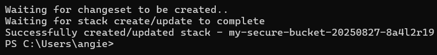
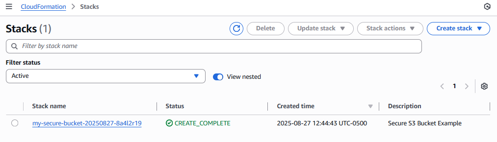

# secure-s3-bucket-cloudformation
A step-by-step guide for deploying a secure S3 bucket using AWS CloudFormation with AWS CLI

# Deploying a Secure S3 Bucket Using AWS CloudFormation

## What is AWS CloudFormation?
AWS CloudFormation is a service that helps you create and manage AWS resources using code instead of clicking around and manually setting things up in the AWS console. It's a simple way to manage infrastructure using code. You write a YAML file (called a template) that describes what you want (like creating a secure S3 bucket), and CloudFormation sets it up automatically. This means you're using Infrastructure as Code (IaC) to automatically provision an S3 bucket with security best practices.

---

## Overview

This guide shows how to use the AWS CLI to deploy a CloudFormation template that creates a secure Amazon S3 bucket that blocks all public access and uses AES-256 encryption for added security

---

## Prerequisites

Make sure you have:
- An AWS account
- AWS CLI installed
- AWS CLI configured (run the command `aws configure` in your terminal and enter your credentials)

---

## Steps to Deploy the CloudFormation Template

### 1. Create the CloudFormation Template

Create a new YAML file called: `secure-s3-bucket.yml`. Copy and paste in the following into your file:

```yaml
AWSTemplateFormatVersion: 2010-09-09
Description: Secure S3 Bucket Example

Resources:
  SecureBucket:
    Type: AWS::S3::Bucket
    Properties:
      BucketName: my-secure-bucket-20250827-8a4l2r19
      PublicAccessBlockConfiguration:
        BlockPublicAcls: true
        BlockPublicPolicy: true
        IgnorePublicAcls: true
        RestrictPublicBuckets: true
      BucketEncryption:
        ServerSideEncryptionConfiguration:
          - ServerSideEncryptionByDefault:
              SSEAlgorithm: AES256
```

---

### 2. Create the CloudFormtion stack using AWS CLI

Run this in your terminal:

```bash
aws cloudformation deploy \
  --template-file secure-s3-bucket.yml \
  --stack-name my-secure-bucket-20250827-8a4l2r19 \
  --capabilities CAPABILITY_NAMED_IAM
```

**Note:**
- Make sure the bucket name is globally unique. If `my-secure-bucket-20250827-8a4l2r19` is already taken, change the bucket name in the YAML file.
- For "--template file", make sure to specify the correct path where your template file is located in your local system.

---

### 3. Monitor Stack Creation

Status will update in your terminal as shown below:



You can also go to CloudFormation in the AWS Console and view the stack status:



---

## Resources

GRC Engineering for AWS by AJ Yawn
